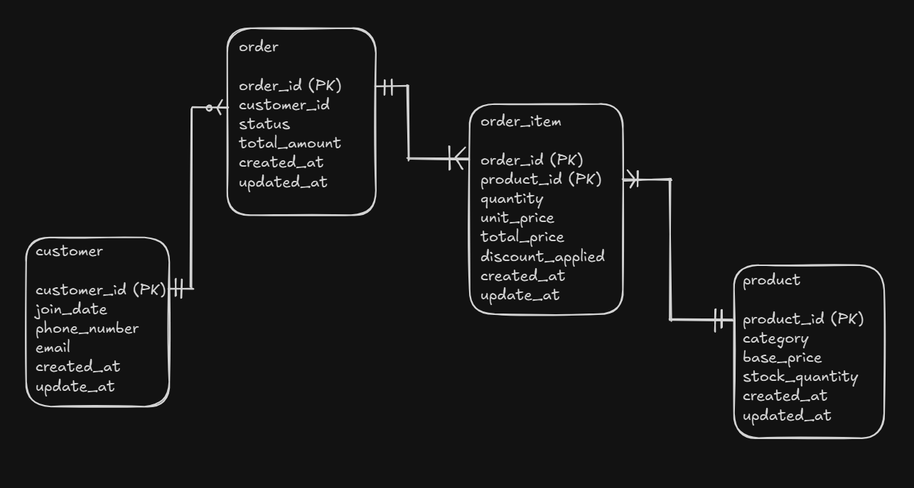

# E-COMMERCE DATA MODEL

This project is designed to manage and process generated online store data. The ETL pipeline extracts data then transforms it into a suitable format, and loads it into a database for further analysis and reporting.

## Project Structure

- `database/`: Directory containing database-related files.
- `data_generator.py`: Script to generate sample data.
- `pipeline.py`: Script to manage data processing pipeline.
- `requirements.txt`: List of dependencies.

## Installation

1. Install the dependencies:
    ```sh
    pip install -r requirements.txt
    ```

## Usage

1. Generate sample data:
    ```sh
    python data_generator.py
    ```
2. Run the data processing pipeline:
    ```sh
    python pipeline.py
    ```

## Database Diagram
Show diagram of database that store information about transctions.





The database consists of the following tables:

### `customer`

- `customer_id`: Unique identifier for each customer.
- `join_date`: Timestamp when the customer was created.
- `phone_number`: Phone number of the customer.
- `email`: Email address of the customer.
- `created_at`: Timestamp when the record was created.
- `updated_at`: Timestamp when the record was updated.

### `product`

- `product_id`: Unique identifier for each product.
- `category`: Category of the product.
- `base_price`: Base price of the product.
- `stock_quantity`: Quantity of the product in stock.
- `created_at`: Timestamp when the product was created.
- `updated_at`: Timestamp when the product was last updated.

### `order`

- `order_id`: Unique identifier for each order.
- `customer_id`: Identifier of the customer who placed the order.
- `order_date`: Date when the order was placed.
- `status`: Status of the order.
- `total_amount`: Total amount of the order.
- `created_at`: Timestamp when the order was created.
- `updated_at`: Timestamp when the order was last updated.

### `order_item`

- `order_id`: Identifier of the order to which the item belongs.
- `product_id`: Identifier of the product.
- `quantity`: Quantity of the product ordered.
- `unit_price`: Price of the product at the time of the order.
- `total_price`: Total price for the quantity of the product ordered.
- `discount_applied`: Discount applied to the order item.
- `created_at`: Timestamp when the order item was created.
- `updated_at`: Timestamp when the order item was last updated.